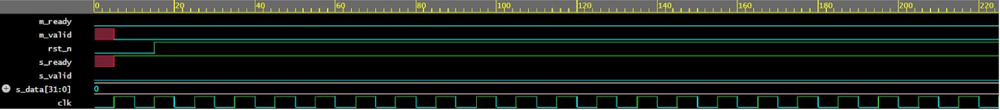
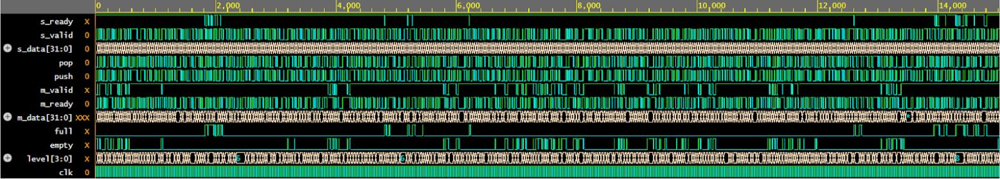

# Parameterizable-Credit-Based-FIFO-ready-valid-Backpressure

This project implements a parameterizable streaming FIFO using a
ready/valid handshake protocol with full backpressure support.
The design is intended to model a production-style hardware block,
emphasizing correctness, configurability, and verification discipline.

The FIFO supports configurable data width and depth, optional
timing-friendly output registration, and an internal skid mechanism
to preserve throughput under sudden backpressure.

## Features

- Ready/valid streaming interface
- Parameterized `DATA_W` and `DEPTH`
- Credit-based flow control with occupancy tracking
- Full backpressure handling
- Optional registered output (`PIPE_OUT`)
- Optional skid behavior for throughput preservation (`SKID_EN`)
- Self-checking verification with assertions and randomized testing

## Interface

**Clock & Reset**
- `clk`   : single clock domain
- `rst_n` : active-low synchronous reset

**Input (Source → FIFO)**
- `s_valid`
- `s_ready`
- `s_data [DATA_W-1:0]`

**Output (FIFO → Sink)**
- `m_valid`
- `m_ready`
- `m_data [DATA_W-1:0]`

**Debug / Observability**
- `level`   : current occupancy
- `empty`
- `full`
- `credits` : available free slots (`DEPTH - level`)

## Architecture

- Circular buffer with parameterized `DEPTH`
- Read and write pointers sized using `$clog2`
- Occupancy counter (`level`) tracks number of stored entries
- `full = (level == DEPTH)`
- `empty = (level == 0)`

The FIFO is implemented as a **circular buffer**, where read and write
pointers advance through a fixed-size memory and wrap around when
reaching the end. This avoids shifting data and enables constant-time
push and pop operations.

Push occurs when: `s_valid && s_ready`  
Pop occurs when:  `m_valid && m_ready`

The occupancy is updated each cycle as:
level_next = level + push – pop

## Optional Modes

### PIPE_OUT (Timing-Friendly Output)

When `PIPE_OUT = 1`, the output interface (`m_valid`, `m_data`) is
registered. This breaks combinational paths through the FIFO and
improves timing closure at the cost of one additional cycle of latency.

### SKID_EN (Throughput Preservation)

When `SKID_EN = 1`, the FIFO internally handles late backpressure
events to prevent loss of an in-flight transfer. This allows the FIFO
to resume full throughput immediately once backpressure is released,
avoiding a bubble cycle.

Both options are controlled via parameters in the same RTL file.

## Verification Strategy

Verification is fully self-checking and includes:

- Directed tests:
  - Reset smoke test
  - Single push/pop
  - Fill-to-full and drain-to-empty
  - Simultaneous push and pop
  - Backpressure scenarios
- Randomized testing with randomized `s_valid`, `m_ready`, and data
- Queue-based scoreboard to verify ordering and data integrity
- SystemVerilog Assertions (SVA) to enforce protocol correctness:
  - No overflow or underflow
  - Output data stability under backpressure
  - Occupancy bounds and correctness

## Waveforms

Waveform screenshots are included to illustrate key behaviors.

### Reset Behavior

After several successful push operations, reset (`rst_n`) is asserted
mid-operation. All internal state is flushed: `level` returns to zero,
`empty` asserts, and both read and write pointers are reset. After reset
release, the FIFO remains in a clean empty state with
no residual data, confirming correct reset behavior.

### Full / Empty Behavior
.JPG)

The FIFO is filled until `level` reaches `DEPTH`, at which point `full`
asserts and `s_ready` deasserts, preventing further pushes. As the sink
begins asserting `m_ready`, data is popped in-order, `level` decrements,
and `empty` asserts when the FIFO is fully drained.

### Backpressure Stall

During this interval, `m_ready` is deasserted while `m_valid` remains
asserted. The output data (`m_data`) remains stable throughout the
stall, demonstrating correct ready/valid protocol behavior under
backpressure.

### Randomized Stress Test

This waveform is taken from a randomized stress test consisting of
1,500 cycles of randomized `s_valid`, `m_ready`, and input data.
Despite arbitrary backpressure and bursty traffic, data ordering is
preserved, no overflow or underflow occurs, and all assertions remain
satisfied.

